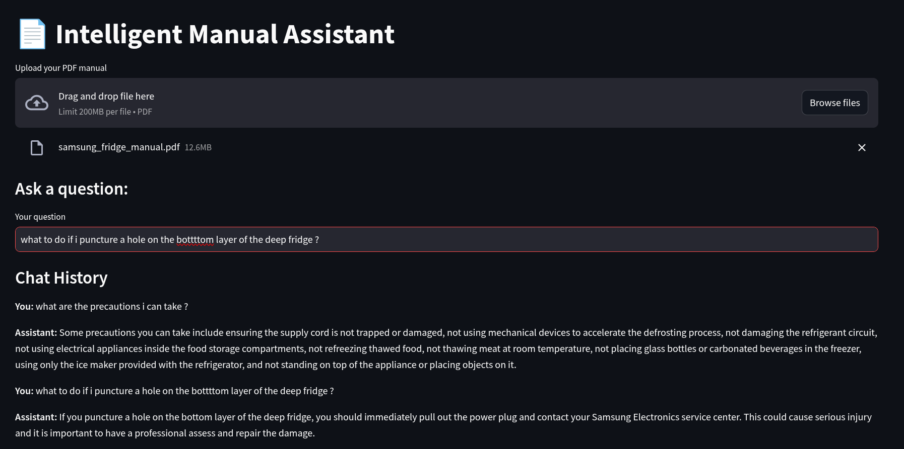

# 📄 Intelligent Manual Assistant — GenAI Q\&A System

## 🔍 Problem Statement

Businesses produce large, dense operational manuals that employees and customers often struggle to navigate. This leads to:

* Wasted time searching for specific information
* Increased support overhead
* Low engagement with documentation

## 💡 Solution

This project implements an **end-to-end AI-powered Question Answering system** that enables users to:

* Upload any business manual (PDF)
* Ask natural language questions
* Instantly get accurate, sourced answers
* View prior Q\&A context (chat-style)

Built using **LangChain**, **FAISS**, **OpenAI LLMs**, and **Streamlit**, this app enhances manual usability, reduces repetitive queries, and improves information accessibility.

## 🚀 Features

* 🔁 **Conversational memory**: Caches and recalls prior questions
* 📚 **PDF support**: Upload long manuals, no preprocessing needed
* 🔎 **Semantic retrieval (RAG)**: Matches relevant sections before querying the LLM
* 💬 **Chat interface**: Intuitive and interactive Q\&A
* 💾 **FAISS vector store**: Local, fast, cost-efficient search

## 📁 Project Structure

```
genai_rag_app/
├── app/
│   ├── config.py              # Loads .env configs
│   ├── loader.py              # PDF to text chunks
│   ├── vector_store.py        # Embeddings + FAISS store
│   ├── qa_chain.py            # Conversational chain + memory
│   └── ui.py                  # Streamlit logic
├── main.py                    # App entrypoint
├── .env                       # Stores OpenAI API key
├── requirements.txt           # All dependencies
└── README.md
```

## 🔧 Setup Instructions

1. **Clone repository**

```bash
git clone https://github.com/krishnavamshithumma/genai-rag-app.git
cd genai-rag-app
```

2. **Install dependencies**

```bash
pip install -r requirements.txt
```

3. **Add your OpenAI key to `.env`**

```env
OPENAI_API_KEY=your-key-here
```

4. **Run the app**

```bash
streamlit run main.py
```

## 🧠 How It Works

* Loads PDF and chunks content
* Embeds chunks via `OpenAIEmbeddings`
* Stores vectors in FAISS
* Uses RAG to find best matches
* Responds via OpenAI LLM
* Remembers prior Q\&A using LangChain memory

## 🏢 Business Impact

✅ Reduces support workload
✅ Increases document value and usability
✅ Enhances customer and employee experience
✅ Immediate access to trusted internal knowledge

## 🔐 Security & Cost

* API key managed securely via `.env`
* Memory avoids repeat LLM calls → cheaper

## 📈 Future Improvements

* Persistent FAISS DB caching
* Support for multi-file or website ingestion
* Azure OpenAI or local model support
* Fine-tuning per-business vocab

## 🚀 Application
 

---

Built with ❤️ to solve real business pain using GenAI.
